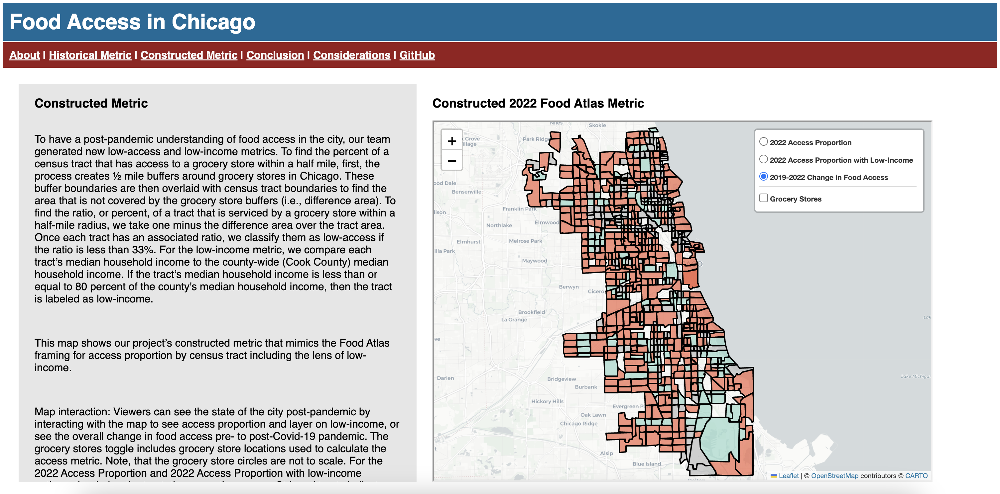

# food.get
The project aims to analyze food access within the Chicago area. The scope of this work
provides an updated food access metric for 2022 to understand communities’ post-pandemic
food access and shows how food access has changed in the city over time. The Atlas Food
Access Research data from 2010, 2015, and 2019 is used as a historic food access metric. To
recreate the 2022 metric, grocery store data from the City of Chicago are paired with household
income information from the United States Census. For understanding and consumption, the
project findings are presented in a Dash web application containing several interactive maps
using Folium.



## Structure of Software
This project is structured in the following sections:
* Data (/data)
  * Data Extraction
    * Pulls grocery stores from City of Chicago and SNAP retailers (/extract_grocery.py)
    * Pulls in and combines historic USDA Food Atlas Research data (/extract_atlas.py)
    * Pulls in census tract boundaries (/extract_tracts.py)
    * Pulls in census tract income and population metrics (/extract_census.py)
  * Cleaning
    * Cleaning grocery stores from City of Chicago and SNAP(cleanup_grocery.py)
    * Adds SNAP information to grocery store locations (match_groceries.py)
* Analysis (/analysis)
  * Recreate Food Atlas metric for 2022 (/generate_metric.py)
  * Generates DataFrames of the combined metrics and grocery stores for use in the map (/agg_metrics.py)
* UI (/ui)
  * Creates maps (/map.py)
  * Creates Dash application (/dash.py)
* Tests (/tests)


## Authors
- [Austin Steinhart](https://github.com/Asteinhart)
- [Danielle Rosenthal](https://github.com/RosenthalDL)
- [Livia Mucciolo](https://github.com/lmucciolo)
- [Stacy George](https://github.com/stacy-george) 

## Installation

1. [Install Poetry to Local Machine](https://python-poetry.org/docs/)

2. Clone the Project 

3. Install Virtual Environment and Dependencies

```bash
poetry install
```

## Usage
Project **must** be run in the Poetry virtual environment. 
Upon completion of the above installation requirements within the project terminal, 
and on each subsequent rendering of the project, initialize the virtual environment by running:

```bash
poetry shell
```
<br />

**Execute the project by running:**
```bash
python -m food_get
```
<sub> This command may take a minute to load the project to terminal.</sub>
<br />
<br />

You are then given an HTTP link, as seen below. Copy the link into your preferred browser to interact with the webpage locally.
<br />

```bash
Dash is running on http://127.0.0.1:8051/

 * Serving Flask app 'food_get.ui.project_dash'
 * Debug mode: off
 * Running on http://127.0.0.1:8051
Press CTRL+C to quit
```

## Sources
- [USDA Food Access Research Atlas](https://www.ers.usda.gov/data-products/food-access-research-atlas/go-to-the-atlas/)
- [American Community Survey 5-Year Data (2022)](https://www.census.gov/data/developers/data-sets/acs-5year.html)
- [City of Chicago Grocery Store Status Map](https://data.cityofchicago.org/Health-Human-Services/Grocery-Store-Status-Map/rish-pa6g)
- [USDA SNAP Data](https://usda-snap-retailers-usda-fns.hub.arcgis.com/)

## Acknowledgments
CAPP 122 Instructor - Professor James Turk

CAPP 122 Project TA - Reza Rizky Pratama
